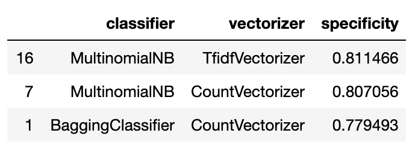

#  Project 3: Web APIs & Classification

Notebook and repo styling ahs been adapted form Tib Book and Tim Dwyer.


#  Keyword Vegan | An Analysis of Subreddits through Natrual Lanugage Processing

# Executive Summary  

# Problem Statement 
MeatFreeLiving.net is a health food and lifestyle retailer and online community. We sell meat-free products and host online forums for a largely Vegan and Vegetarian clientele. 

Though we are strictly meat-free, we do not sell exclusively vegan products.  

To avoid advertising our egg and dairy products to our vegan users, we want to develop a model using Natural Language Processing to identifying our vegan users through their posts and comments on our online forums.

Our model will try to identify Vegans and will optimize for specificity (i.e. reduce false negatives). We will aim for high specificity for two reasons:
1. A large number of our vegan users are animal rights activists. Some might have strong feelings about animal products and potentially leave our site/company if they are advertised egg or dairy products.
2. Also, we would like to avoid wasting advertising budget on users who are not interested in egg or dairy products. Vegetarians are likely still interested in vegan products, but not vice-a-versa. Therefore, false positives will not be as much of a concern for our model.

We will use ~10,000 posts from the two subreddits [r/Vegan](https://www.reddit.com/r/Vegan/) and [r/Vegetarian](https://www.reddit.com/r/Vegetarian/) to develop several models utilizing different NLP vectorizers and Classifieers and then identify the method that has the highest combination of  accuracy and specificity.

Vectorizers included in analysis:
  - TFID Veectorizer
  - Count Vectorizer

Classifiers included in analysis:
  - Multinomial Naive Bayes
  - Random Forest Classifier
  - Logistic Regression
  - Bagging Classifier
  - Ridge Classifier
  - Extra Trees Classifier
  - Gaussian Naive Bayes
  - Decision Tree Classifier
  - AdaBoost Classifier

# Repo Structure
```
03_Keyword_Vegan
├── README.md
├── code
│   ├── 00_Data_Collection.ipynb
│   ├── 01_Data_Cleaning.ipynb
│   ├── 02_Exploratory_Data_Analysis.ipynb
│   ├── 03_Preproccessing_and_Feature_Engineering.ipynb
│   ├── 04_Model_Explorations.ipynb
│   ├── 05_Model_Tuning.ipynb
│   └── 06_Findings_and_Recommendations.ipynb
├── data
│   └── data.csv
├── images
└── presentation.pdf
```


## Description of Data
The data collected for this project were `'titles'` and `'selftext'` from reddit posts from the two subreddits [r/Vegan](https://www.reddit.com/r/Vegan/) and [r/Vegetarian](https://www.reddit.com/r/Vegetarian/). These two columns were then concatenated into a column called `'text'`. This string was then passed through BeautifulSoup to strip any stray html-formatting, and then finally, it was passed through a WordNetLemmatizer to standardize and reduce our vocabulary before analysis.

|feature|data type|description|
|---|---|---|
|title|str|The title of the reddit post. Required for each field thoguh could often be an invalid string and ended up being deleted. eg. titles that were simply lists of emoticons.|
|selftext|str|The body of the reddit post. Many of these items were `null` since the API did not record images, and we were not examining data in this analysis. Also some selftext had been removed and in it's place was the string `'[removed]'`. These `'[removed]'` strings were replaced with a `null` value. All `null` values were then replaced with the empty string.|
|text|str|**Feature Column:** The concatenated and cleaned text from the `'title'` and `'selftext'` features. All analysis was ultimately done on this column as the corpus.|
|vegan|binary|**Target Column:** This column was 0 if the post was from `r/Vegetatian` and 1 if the post was from `r/Vegan`.|

## Data Collection and Munging
We have gathered a solid body of data for our NLP analysis. We did this through submitting batch request through the pushift.io API. We then stored the data of interest into a corpus that we saved as a CSV.

In the next notebook we will clean our data and do some initial exploratory analysis. After that we will have a better sense of direction for building our Vegan classification model.

We cleaned our data to prepare it for some exploratory analysis. We removed duplicates and empty strings and standardized our data from HTML formatting to plain text using BeautifulSoup and some custom functions. We then combined all of our textual data into a single corpus and saved this all to our data.csv.

## Model Performance on training/test data
To select the best model, we created a function that passed different combinations of vectorizers and classifiers into a GridSearchCV function to find the best hyperparameters. 

After building this function, our process will be as follows:
1. Select a set of hyperparameters for our vectorizer to fit our models.*
2. Fit and score the classifiers through the function mentioned above.
3. Store and evaluate their metrics into a dataframe.
  - Metrics include:
    - Best cross-validation score
    - Training Score
    - Test Score
    - Sensitivity
    - Specificity
    - Run-time**
4. Finally, create an ensemble method using the best combination of vectorizer, classifier and  hyperparameters from the previous 3 steps and evaluate that performance against our individual models.

### After running our models, we received the following results:


### Top Compound Models (an interaction column between test score and specificity. This could probably be replaced with an f1 score.)

### Top Specificity Models

### Top Testing RMSE Models


## Primary Findings, Conclusions and Recommendations
Though our model does not have the highest accuracy, it does have the highest specificity out of our 1564 models.  
Still, at 81.1% this means ~2 out of 10 vegan users are still being labeled as vegetarian.  

**Recommendation:**
We continue tweaking hyperparameters, including increasing the threshold for a user to be classified as a Vegan. This would result in a higher specificity score.  
However, this would decrease accuracy and result in more Vegetarians being classified as Vegan.

**Further Steps:**  
We would need to do a cost-benefit analysis on the capital loss from reducing our egg-and-dairy advertisement to misidentified Vegetarians against the profit loss of potentially losing a Vegan customer from out site completely.  
