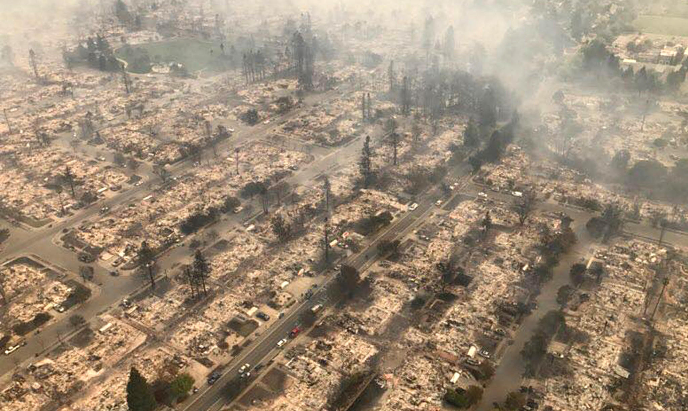

# Evactuation Twitter

---

## Detecting & Mapping Live Road Closures Using NLP, Named Entity Recognition, and Supervised Modeling Techniques

  

Authors: Gifford Tompkins, Trevor Robichaux, Jason Esquivel

## Problem Statement
During disasters such as wildfires, search and rescue teams must be able to search for and get to survivors as fast as possible. Current navigation systems allow responders to calculate travel time and distance between origin and destination and propose an optimal route to the destination. However, many of the current platforms do not rely on real-time data (e.g. road closures, damaged roads etc.) which can cause invaluable time to be lost.

This project leverages social media and other datasets to identify real time road closures due to damaged roads, power outages and other blocked routes that may affect traffic lights, travel time, travel safety and more.The system will allow rescue teams and the public to search for any of these conditions and identify if and where they exist within California. (street, neighborhood, city etc.)

## Overview
During a disaster scenario, GPS Information Systems (GIS) can be a useful tool to navigating around road closures and traffic. However, GIS systems can be slow to update and may require proprietary authorization to plot road closures. Fortunately, social media can provide real-time and accurate updates on road closures. Through aquiring data about road closures from Twitter, we created an app that can check whether or not a road is closed or not. If the road is closed, our app is able to create an optimal route to avoid any road closures. Users are able to submit a route request which gives us two essential pieces of information, the counties the user is passing through and the coordinates we will search through for known traffic. Using that information, we check our Twitter library for closures in the specified area by district. The next step is to compare "Live Traffic Alerts" to Known Alerts in the area. Locations are extracted from tweets and NLP methods. Locations then get passed into Here.com's Places API. If the closure is accounted for, then Here.com automatically routes around the closure for us, and the user can simply receive their instructions. If not, we insert the "Avoid Area" message and use Here.com area avoidance methods to create a new route.

## Methodology
The following is how we achieved our goal of collecting, modeling, and mapping road closures from social media.
- **Step 1: Data Collection (Twitter, Wikipedia, Here.com)**: We use the Tweepy and GetOldTweets modules to access the Twitter API. We used the Twitter API to get Tweets from CalTrans Twitter accounts from twelve different districts. Since our focus was looking at Twitter during California Fires, we gathered notable fire history going back fifteen years. We also scraped the district names, street names, and counties from Wikipedia. 
- **Step 2: Exploratory Research (Here.com, Google APIs)**: We began our exploration of Here.com vs Google Map API's in order to determine how best to utilize these tools in the following areas: 
    - Specialize in mapping and location services
    - Captures location content 
    - Road networks, buildings, parks, and traffic patterns
    - Reroute an alternative route using geolocations
- **Step 3: Feature Engineering (named entity extraction with spaCy)**: We attempted to implement SpaCy into our project to extract street names in order to plot specific latitude and longitude points within Google or Here’s API’s. 
We noticed SpaCy required a significant amount of training the model to recognize the street names. With thousands of streets we would need to manually input from our Tweets, we chose to look for alternatives. 
- **Step 4: Application Workflow**: in a nutshell, we are able to take a tweet displaying information about a road closure and do the following:
    - Generate Twitter Closure Library of recent closures from twitter with county, city, street name and avoiding_rectangles.
    -  User submits routing request.
    - Based on city, county and date, the Twitter Closure Library is cross referenced for relevant closures.
    - Relevant closures are checked against Here.com’s Traffic Incidents Database.
    - If closures are represented in Here.com, use Here.com to generate directions.
    - If closure is not represented, input “avoidinging_rectangles” from library and reroute user.

## Results
- We were able to successfully identify and extract key components from tweets relating to street names and cross sections as well as information on the reasoning for the closures. Using this information, we are able to communicate it to Here.com's API in order to plot the closure on their map and create a reroute plan. Unfortunately, with the limitations of spaCy needing a substantial amount of training to accurately identify location information from tweets and automatically communicate this information to Here.com, we are forced to manually input data into Here.com's API in order to gain a detour plan. 

## Future Steps
- Teach SpaCy model to recognize all street name token/entitiies in order to automatically detect and plot block rectanges in Here.com
- Twitter Accounts: expand accounts we collect data from to include more local safety and resuce accounts as well as potentially include civilian accounts. 
- Although Here.com already displays a readily available HTML script, if we are able to get our data in the hands of a Web Designer/Software engineer we may be able to create a more autonomous method of creating redirected routes and displaying them to the end user.

