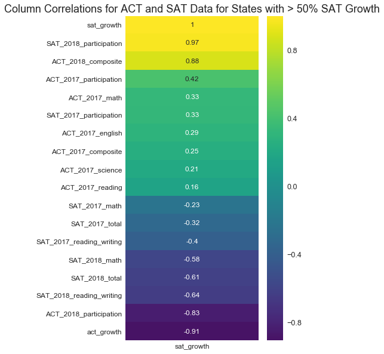
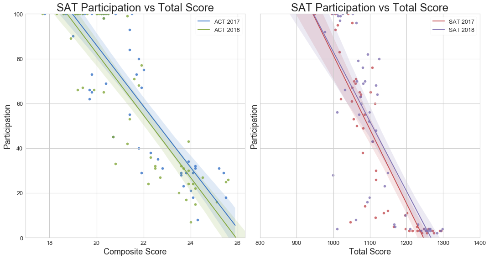

#  Project 1: Standardized Testing, Statistical Summaries and Inference

# SAT/ACT Analysis Project

# Problem Statement
We are going to look at why states like Colorado and Illinois shifted so dramatically from the ACT to the SAT.
We have seen remarkable increase in participation in states like Colorado and Illionis where the College Board won bids for the standardized college entrance exam for the state. The goal of this project is to find what factors made those two states successful and target other states that may result in official state adoption of the SAT and near 100% participation in future years.

# Data Dictionary
| Feature | Type | Dataset | Description |
|---|---|---|---|
|state|string|ACT|State from which the ACT data is colllected.|
|ACT_YYYY_participation|float|ACT|The percentage of high-school students in each state that participated in the SAT.|
|ACT_YYYY_english|float|ACT|The average score on the English section of the ACT.|
|ACT_YYYY_math|float|ACT|The average score on the Math section of the ACT.|
|ACT_YYYY_reading|float|ACT|The average score on the Reading section of the ACT.|
|ACT_YYYY_science|float|ACT|The average score on the Science section of the ACT.|
|ACT_YYYY_composite|float|ACT|The average composite score from all sections of the ACT.|
|SAT_YYYY_participation|float|SAT|The percentage of high-school students in each state that participated in the SAT.|
|SAT_YYYY_reading_writing|integer|SAT|The average score on the "Evidence Based Reading and Writing" section of the SAT.|
|SAT_YYYY_math|integer|SAT|The average score of the Math section of the SAT.|
|SAT_YYYY_total|integer|SAT|The average total score of the SAT per state.|
|sat_growth|float|SAT|The percentage growth in SAT Participation from 2017 to 2018.|
|act_growth|float|ACT|The percentage growth in ACT Participation from 2017 to 2018.|

# Repo Structure:
- code (repository):
    - `SAT_ACT_Analysis_Jupyter_Notebook`: Jupyter Notebook with findings and analysis.
- data (repository):
    - raw ACT and SAT data
    - compiled data from data cleaning
- images (repository):
    - image folder
- `READ ME.md` file

# Executive Summary
- Data Collection and Munging:
    - The data raw data we were dealing with were subtest and composite/total scores as well as  the participation rate for the SAT 2017, SAT 2018 and ACT 2017 tests. For the ACT 2018 test we only had access to the composite and participation data.
-   Cleaning this data involved removing data rows that were not included in each test (i.e. the ACT test had a 'National' average entry), as well as removing data compilation errors like duplicated rows, mistyped values, etc. These tables were indexed and joined on the `State` column.

- Exploratory Data Analysis:
    - In exploring the data it was clear that Illinois and Colorado were outliers in the participation growth of the SAT.
 
|State|act_growth|sat_growth|
|---|---|---|
|Illinois|-53.8%|1000.0%|
|Colorado|-70.0%|809.1%|
|West Virginia|-5.8%|100.0%|
|Arkansas|0.0%|66.7%|
|Ohio|33.3%|50.0%|
 
- I decided to take a look at all states with a SAT participation growth rate 50% or over between 2017 and 2018. Creating a heatmap with only  these  states, I was able to find strong correlations and focus my search on other states with the same features.
  
  

  
  
# Findings
Pseudo-interestingly, there is a strong positive correlation between `sat_growth` and `ACT_2018_composite` and `ACT_2018_participation` scores as well as a strong negative correlation between `sat_growth` and  `ACT_2018_participation` and `act_growth`. These correlations are all pointing to the same fact. According to [CollegeVine blog post](https://blog.collegevine.com/here-are-the-average-sat-scores-by-state/), where we initially got out data, "higher scoring states having lower participation rates" for the SAT. This is supported by the data as shown in the scatter plots below:

.

Therefore we look to the next strongest correlations wich are the negative correlations with `SAT_2018_total`, `SAT_2018_math` and `SAT_2018_reading_writing` scores. This is still related to our findings above. When students are forced to take the SAT, the overall average score of the state decreases.

Since all of our strong correlations are eliminated, let's restrict our states of interest to those that increased their `sat_growth` by over 50%. 

We see here that, strangely enough, scores in the ACT 2017 test:`ACT_2017_participation`,`ACT_2017_english`,`ACT_2017_math`,`ACT_2017_reading`,`ACT_2017_science`,`ACT_2017_composite` have a strong correlation with `sat_growth`. This is perhaps surprising, but students and parents who are most likely to find fault with their test of choice are those that score well but are unsatisfied with its outcomes. i.e. Students that score well on the ACT and don't get into the college of their choice.

Therefore, the data would suggest that states with high ACT partipation rates are the most likely ones to turn into SAT states.

**_It should be noted that states rates of student metriculation into universities would be a very important data point here._**

As well as college matriculation, according to [this article](https://www.chalkbeat.org/posts/co/2015/12/23/goodbye-act-hello-sat-a-significant-change-for-colorado-high-schoolers/), political leanings and demographic/urban make-up can affect a states desire for change. In Colorado, the strongest motivator for change was dissatisfaction with the ACT that had been  [required since 2001](https://www.chalkbeat.org/posts/co/2015/12/15/testing-giants-vie-to-provide-colorado-high-school-exams/#.Vnsoy5MrL-Y).

Therefore, we will look at states with high ACT scores and participation as the most likely recruits for state-wide SAT adoption.

# Recommendations and Further Steps
 
|State|ACT_2018_participation|ACT_2018_composite|SAT_2018_participation|
|---|---|---|---|
|Wisconsin|100.0%|20.5|3.0%|
|Utah|100.0%|20.4|4.0%|
|Ohio|100.0%|20.3|18.0%|
|Kentucky|100.0%|20.2|4.0%|
|Nebraska|100.0%|20.1|3.0%|
|Missouri|100.0%|20.0|4.0%|
|Montana|100.0%|20.0|10.0%|
 
- **Recommendations:** The most likely states to transfer loyalties from the ACT to the SAT are those with high participation rates and high scores. This is because these states are most likely to be disillusioned by their given college entrance exam (the ACT) and the promises it provides of getting into a good university.

- **_Further Steps:_** In another iteration of this analysis: 
    - I would like to collect data on state matriculation rates. Students and parents are more likely to be dissatisfied with the ACT if they are getting high scores, and they are unable to get into college or the college of their choosing.
    - I would also like to include polical and socio-economic make up of states that have made recent changes and  see  if there are any correlations there.
    - All this being said, an analysis on participation retention should also be done, as states are likely to become dissatisfied with the SAT for the same reasons.

 - **In conclusion:** I would focus research on the 7 states above pending further analysis on matriculation rates. They likely have mandated ACT exams and parents and school board members who are not seeing the results they want are likely in the mood to switch for a test that demands less, practice time, has more history and hasn't failed them (at least recently) in getting their kids into college.
